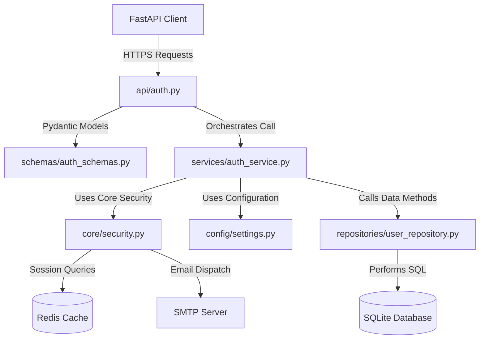

# Authentication Module Architecture Reference

This document defines the architectural specification of the **Authentication** module of CrickAIt, which serves as the canonical backend reference implementation. All future backend modules must conform to these design rules, layer structures, and dependency guidelines.

---

## 1. Overview

### Purpose
The Authentication module manages user identities, registration, login sessions, Google OAuth federated login, password resets via OTP (One-Time Passwords), profile updating, and account deletion.

### Responsibilities
*   **Identity Validation:** Registering users, enforcing password complexities, validating email schemas, and validating Turnstile CAPTCHA.
*   **Session Management:** Issuing unique session tokens, saving/retrieving session caches in Redis with a 24-hour Time-To-Live (TTL), and managing logouts.
*   **Password Recovery:** Initiating recovery via email OTPs, tracking expiration limits, and executing resets.
*   **Account Controls:** Fetching/patching user profile fields and orchestrating cascade deletions of user data (checkpoints and notifications).

### Why it was Extracted
Prior to extraction, all auth endpoints, SQL executions, Redis manipulations, and business rules were coupled inside the flat monolith file `backend/app/main.py`. This created several architectural issues:
*   **Zero Separation of Concerns:** Database structure adjustments and routing schema updates directly impacted the core execution logic.
*   **Circular Import Risk:** Circular chains made modular extraction of subcomponents (such as checkpointers) impossible.
*   **Low Testability:** Raw endpoints could not be unit tested in isolation without spawning the entire ASGI application and mocks.

### Problems Solved
*   **Layer Isolation:** Data schema parsing (Pydantic), endpoint definitions (FastAPI), business rules, and SQL access are isolated from one another.
*   **Test Pollution Prevention:** Isolated mock checks prevent test runs from polluting local vector stores or databases.
*   **Event-Loop Safety:** Redefined connection instantiations avoid multi-threaded event loop exceptions during concurrent test suite execution.

---

## 2. Architecture & Data Flow

### Architecture Interaction Diagram



### Request Flow Sequence Diagram (Example: Login)

```mermaid
sequence_diagram
    autonumber
    actor User
    participant Router as api/auth.py
    participant Service as services/auth_service.py
    participant Security as core/security.py
    participant Repository as repositories/user_repository.py
    participant Database as SQLite DB
    participant Redis as Redis Cache

    User->>Router: POST /auth/login (LoginRequest)
    Router->>Security: verify_turnstile(token)
    Security-->>Router: Turnstile Result (bool)
    Note over Router: Enforces CAPTCHA checks
    Router->>Service: login(LoginRequest)
    Service->>Repository: get_user_by_username_or_email(username)
    Repository->>Database: SELECT * FROM users WHERE...
    Database-->>Repository: Row Data
    Repository-->>Service: User Dict
    Service->>Security: verify_password(stored, input)
    Security-->>Service: Password Valid (bool)
    Service->>Redis: setex(session:token, 86400, username)
    Redis-->>Service: Success
    Service-->>Router: Token & Profile Details
    Router-->>User: 200 OK (Token, Profile Data)
```

---

## 3. Folder Structure & File Explanations

The module structure is laid out under the backend root as follows:
```
backend/app/
├── api/
│   └── auth.py                 # Endpoint routing mapping
├── services/
│   └── auth_service.py        # Core business workflow rules
├── repositories/
│   └── user_repository.py     # SQLite SQL data access layer
├── schemas/
│   └── auth_schemas.py        # Input and output validation shapes
├── core/
│   └── security.py            # Hashing, token, Redis, SMTP and CAPTCHA
└── config/
    └── settings.py            # Configuration settings loader
```

### Purpose of Each File
*   [settings.py](file:///home/eb157/CrickAIt/backend/app/config/settings.py): Centralizes all environment loading (`load_dotenv()`) and provides type-casted, fallback-aware variables. No other files should parse environment variables directly.
*   [auth_schemas.py](file:///home/eb157/CrickAIt/backend/app/schemas/auth_schemas.py): Defends system borders by validating request payloads using Pydantic. It keeps the core routing clean of manual validation logic.
*   [security.py](file:///home/eb157/CrickAIt/backend/app/core/security.py): Holds non-business security implementations, SMTP client execution, and Turnstile CAPTCHA validations. Handles loop-aware `httpx.AsyncClient` initialization to prevent cross-loop execution errors in tests.
*   [user_repository.py](file:///home/eb157/CrickAIt/backend/app/repositories/user_repository.py): Decouples database queries from workflows. Translates SQLite rows into standard Python dictionaries.
*   [auth_service.py](file:///home/eb157/CrickAIt/backend/app/services/auth_service.py): The core domain file. Contains the state transitions, domain assertions, and coordinate logic.
*   [auth.py](file:///home/eb157/CrickAIt/backend/app/api/auth.py): Maps HTTP paths, defines FastAPI tags, and serves as the HTTP adapter calling the underlying Service.

---

## 4. Dependency & Import Rules

### Dependency Direction Rules
The system enforces strict **Dependency Inversion** rules. Dependencies flow inwards toward core business rules and configuration, never outwards.

```
[api/auth.py] ---> [services/auth_service.py] ---> [repositories/user_repository.py]
      \                     |
       \                    v
        +------------> [core/security.py] ---------> [config/settings.py]
```

*   **Allowed Dependencies:**
    *   Routers can depend on Services, Schemas, and Security.
    *   Services can depend on Repositories, Schemas, Security, and Settings.
    *   Repositories can depend only on Settings.
*   **Forbidden Dependencies:**
    *   **Repository $\rightarrow$ Service / Router / API:** Repositories must never be aware of HTTP states, routers, or controllers.
    *   **Service $\rightarrow$ Router / API:** Workflows must operate independently of FastAPI framework details.
    *   **Security / Settings $\rightarrow$ Service / Repository:** Utilities must remain completely stateless regarding business entities.

### Circular Dependency Prevention
To prevent circular imports (e.g. `main.py` importing `auth.py` router, while `auth.py` imports `redis_client` from `main.py`):
1.  **Move shared instances early:** `redis_client` and `get_http_client` must reside in `core/security.py` or separate utilities.
2.  **Re-export at system borders:** Main application scripts (`main.py`) should import the shared instances from `core/security.py` and re-export them globally for backwards compatibility:
    ```python
    # Inside backend/app/main.py
    from backend.app.core.security import redis_client, get_current_user
    ```

### Import Conventions

*   **Correct Import Pattern:**
    ```python
    from backend.app.schemas.auth_schemas import RegisterRequest
    from backend.app.repositories.user_repository import UserRepository
    from backend.app.config.settings import settings
    ```
*   **Incorrect Import Pattern (Avoid absolute app relative or parent paths):**
    ```python
    from ..main import redis_client               # Avoid parent directory dots
    from app.main import app                       # Avoid omitting root package
    ```

---

## 5. Responsibilities by Layer

### Configuration Layer
Loads variables and verifies constraints on startup.
```python
# config/settings.py
class Settings:
    REDIS_URL: str = os.getenv("REDIS_URL", "redis://localhost:6379")
    DATABASE_PATH: str = "data/sqlite/checkpoints.db"
```

### Schemas Layer
Houses schema validation. Business rules do not go here.
```python
# schemas/auth_schemas.py
class LoginRequest(BaseModel):
    username: str
    password: str
```

### Security Layer
Contains stateless helpers and event-loop aware async HTTP clients.
```python
# core/security.py
def hash_password(password: str) -> str:
    # PBKDF2 hashing implementation
    return f"{salt}:{key_hex}"
```

### Repository Layer
Executes raw SQL and maps results to standard Python structures.
```python
# repositories/user_repository.py
class UserRepository:
    async def get_user_by_username(self, username: str) -> Optional[dict]:
        async with aiosqlite.connect(self.db_path) as conn:
            conn.row_factory = aiosqlite.Row
            async with conn.execute("SELECT * FROM users WHERE username = ?", (username,)) as c:
                row = await c.fetchone()
                return dict(row) if row else None
```

### Service Layer
Houses business assertions, workflow controls, and coordinates data mutations.
```python
# services/auth_service.py
class AuthService:
    async def login(self, request: LoginRequest) -> dict:
        user = await self.user_repo.get_user_by_username(request.username)
        if not user or not verify_password(user["password_hash"], request.password):
            raise HTTPException(status_code=400, detail="Invalid credentials")
        # Generate token and cache session...
```

### Router Layer
Translates request payloads, manages route registration, and invokes services.
```python
# api/auth.py
@router.post("/login")
async def login(request: LoginRequest):
    return await auth_service.login(request)
```

---

## 6. Error Handling Strategy

*   **Input Validation Errors:** Handled implicitly by FastAPI returning `422 Unprocessable Entity` when incoming payloads violate Pydantic validation rules.
*   **Authentication & Authorization Failures:** Services raise `fastapi.HTTPException` with status code `401 Unauthorized` or `403 Forbidden` and explicit error strings (e.g. `Invalid credentials`).
*   **Database Failures:** Handled inside Service layers using `try-except` blocks. Service catches operational SQLite errors, logs details via standard loggers, and throws a sanitised `500 Internal Server Error` to the client.
*   **Security CAPTCHA Failures:** Handled at routing or service boundary level, returning `400 Bad Request`.

---

## 7. Testing Strategy

*   **Unit Tests:** Verify individual business functions in `auth_service.py` and queries in `user_repository.py` by mocking other layers using `unittest.mock`.
*   **Integration Tests:** Verify endpoint flows via FastAPI's `AsyncClient`.
*   **Mock Isolation:** Tests must use mock databases (`test_checkpoints.db`) and configure `redis_client.use_mock = True` to run completely in-memory.
*   **Loop-Bound Safeguard:** Mock connections and HTTP client objects are bound dynamically using `asyncio.get_running_loop()` to ensure compatibility with `pytest-asyncio` loop environments.
*   **Coverage Expectation:** The minimum required overall statement coverage for any code modification or new module is **35%**, though the Authentication module establishes a baseline of **77%**.

---

## 8. Architectural Rules

### The 20 Do's
1.  **Keep routers thin:** Routers must contain at most 3-5 lines of code, delegating all operations to services.
2.  **Enforce service-only business logic:** Enforce all domain checks and business assertions inside services.
3.  **Encapsulate database access:** Only repositories may execute SQLite queries.
4.  **Use Pydantic schemas:** Validate all request payloads using Pydantic models.
5.  **Use absolute imports:** Format all imports from the repository root (e.g. `from backend.app.core...`).
6.  **Convert SQLite rows to dicts:** Ensure repositories always cast `aiosqlite.Row` objects to Python `dict` before returning.
7.  **Isolate database transactions:** Ensure repositories manage their own connection context via `async with aiosqlite.connect`.
8.  **Use settings variables:** Load all database paths and credentials from the unified `settings` object.
9.  **Decouple Redis queries:** Restrict Redis operations to the service and security layers.
10. **Implement loop-aware clients:** Recreate global HTTP clients if the active thread's event loop changes.
11. **Close HTTP clients:** Always run `.aclose()` on lifespan termination.
12. **Bypass Turnstile in tests:** Provide a test-override mock setting for Turnstile tokens.
13. **Clean up user relationships on delete:** Cascading deletions must clear checkpoint logs and writes.
14. **Strip user parameters:** Strip and lower-case usernames and emails before persistence or lookup.
15. **Use UUIDs for session keys:** Generate unpredictable session tokens using `uuid.uuid4().hex`.
16. **Isolate test databases:** Override connection factories in `conftest.py` to point to `test_checkpoints.db`.
17. **Set TTL on sessions:** Set a 24-hour expiration (86400 seconds) on Redis session keys.
18. **Enforce password rules:** Enforce length and character complexity rules in the registration workflows.
19. **Prevent user enumeration:** Return a general success message on password reset requests, even if the email does not exist.
20. **Isolate checkpointer locks:** Bind the database locks to the running event loop.

### The 20 Don'ts (Anti-Patterns)
1.  **No SQL inside routers:** Never write SQL strings or call `aiosqlite.connect` inside router files.
2.  **No business logic inside repositories:** Never implement rules like "is username taken" inside a repository.
3.  **No HTTP exceptions inside repositories:** Repositories must raise operational or custom exceptions, never FastAPI `HTTPException`.
4.  **No parent imports:** Do not use relative parent syntax (`..`) to import core modules.
5.  **No direct dotenv calls:** Do not call `os.getenv` or `load_dotenv` outside of `config/settings.py`.
6.  **No global database connections:** Do not share a single global `aiosqlite` connection object across requests.
7.  **No hardcoded database paths:** Avoid hardcoding `"checkpoints.db"` inside repository methods.
8.  **No naked session IDs in SQLite queries:** Always scope thread keys as `{username}:{session_id}`.
9.  **No stateful endpoints:** Do not store user-session details in global Python variables.
10. **No circular imports:** Do not import `app` or `main` into API routers or security sub-layers.
11. **No unhandled SMTP exceptions:** Never let SMTP login failures crash request workflows; catch and log them.
12. **No plain-text password storage:** Never write passwords directly to logs or databases.
13. **No direct model imports in router responses:** Do not return raw DB objects directly from endpoints.
14. **No persistent test DB pollution:** Do not execute tests against production checkpoint databases.
15. **No missing error logger blocks:** Do not write empty `except:` blocks; always log exceptions.
16. **No manual JSON serialization in DB queries:** Delegate row parsing to database factories, not manual string splits.
17. **No duplicate password validation rules:** Enforce registration rules inside a single validation logic.
18. **No blocking operations:** Do not call synchronous functions like `time.sleep()` or `requests.get()` inside async routes.
19. **No raw HTML strings inside services:** Do not write HTML email templates directly inside service classes.
20. **No bypassing schemas for payloads:** Do not read raw request bodies via `await request.body()` when Pydantic models can validate them.

---

## 9. Future Improvements

These designs should be considered during future system iterations:
*   **PostgreSQL Migration:** The `UserRepository` methods are designed to be easily compatible with PostgreSQL databases.
*   **Abstract Repositories:** Introduce a base repository interface (`BaseRepository`) using abstract base classes to allow swapping database engines.
*   **JWT Sessions:** Transition from stateful Redis sessions to stateless JWT tokens to improve system scalability.
*   **Dependency Injection:** Implement FastAPI's dependency injection system (`Depends`) to inject services and repositories into routers, making testing even easier.
