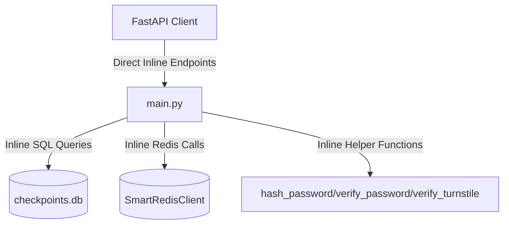
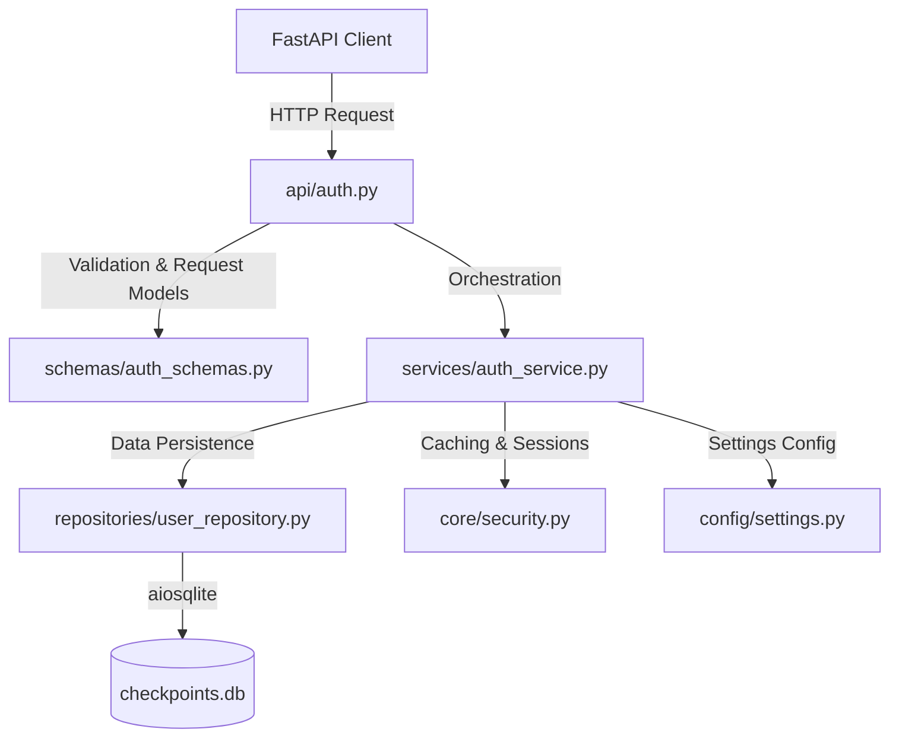

# Authentication Domain Refactoring Report

This report documents the architectural separation of the Authentication domain from the monolith `backend/app/main.py` into a clean-layered structure under `backend/app/`.

---

## 1. Architectural Changes

### Architecture Before
All authentication components were bundled inside `main.py` as a flat structure:


### Architecture After
The authentication flow has been decomposed into distinct layers following standard Clean Architecture boundaries:


---

## 2. Extraction Inventory

### Files Created
1.  [settings.py](file:///home/eb157/CrickAIt/backend/app/config/settings.py) — Central settings manager.
2.  [auth_schemas.py](file:///home/eb157/CrickAIt/backend/app/schemas/auth_schemas.py) — 9 Pydantic request models.
3.  [security.py](file:///home/eb157/CrickAIt/backend/app/core/security.py) — Cryptography, Turnstile, OTP generation, email SMTP client, `SmartRedisClient` instance, and FastAPI dependencies.
4.  [user_repository.py](file:///home/eb157/CrickAIt/backend/app/repositories/user_repository.py) — SQLite data-access methods for users and resets.
5.  [auth_service.py](file:///home/eb157/CrickAIt/backend/app/services/auth_service.py) — Pure business domain rules (Register, Login, Password Recovery).
6.  [auth.py](file:///home/eb157/CrickAIt/backend/app/api/auth.py) — FastAPI APIRouter exposing endpoints.

### Functions Extracted
*   `hash_password` & `verify_password` $\rightarrow$ [security.py](file:///home/eb157/CrickAIt/backend/app/core/security.py)
*   `generate_otp` & `send_otp_email` $\rightarrow$ [security.py](file:///home/eb157/CrickAIt/backend/app/core/security.py)
*   `verify_turnstile` $\rightarrow$ [security.py](file:///home/eb157/CrickAIt/backend/app/core/security.py)
*   `get_current_user` $\rightarrow$ [security.py](file:///home/eb157/CrickAIt/backend/app/core/security.py)
*   `get_http_client` $\rightarrow$ [security.py](file:///home/eb157/CrickAIt/backend/app/core/security.py)

---

## 3. Backwards Compatibility & Integration
*   To avoid breaking other modules (e.g. Chat, Live Scores, Retriever) and test fixtures, `main.py` re-exports the required variables:
    ```python
    from backend.app.core.security import (
        redis_client,
        get_current_user,
        get_http_client,
        hash_password,
        verify_password,
        SmartRedisClient
    )
    ```
*   Circular import safety is guaranteed by completely decoupling `redis_client` and `get_http_client` from `main.py`.

---

## 4. Risks & Verification Summary
*   **Risks:** High-risk actions include potential SQLite lock violations on concurrent checkpoints access.
*   **Verification:** Covered by 36 unit/integration tests running against an in-memory SQLite DB and mock Redis client, passing successfully.
