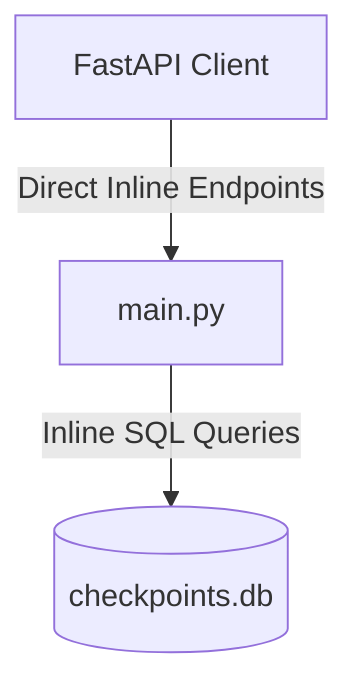
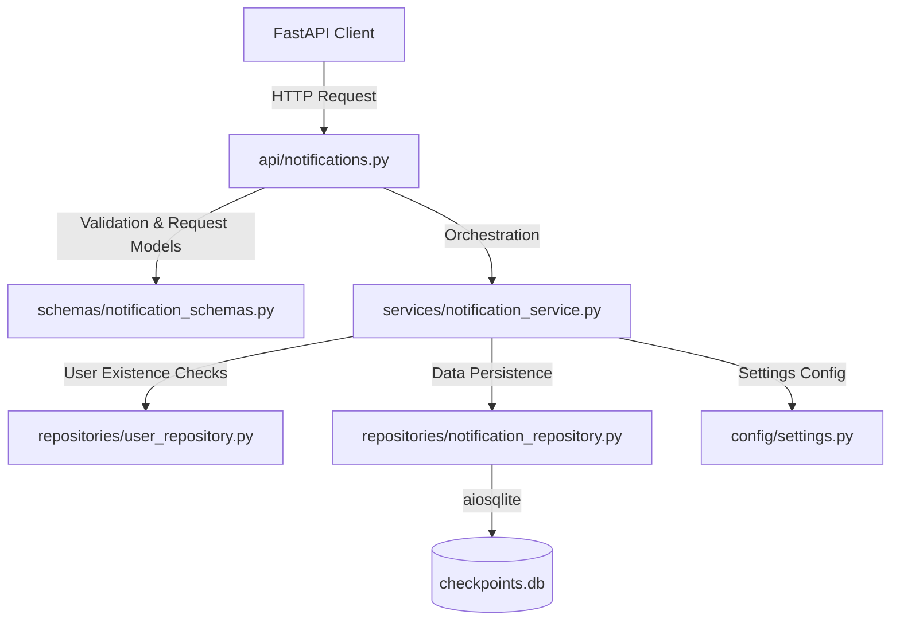

# Notifications Domain Refactoring Report

This report documents the architectural separation of the Notifications domain from the monolith `backend/app/main.py` into a clean-layered structure under `backend/app/`.

---

## 1. Architectural Changes

### Architecture Before
All notification components were bundled inside `main.py` as a flat structure:

### Architecture After
The notification flows have been decomposed into distinct layers following standard Clean Architecture boundaries:

---

## 2. Extraction Inventory

### Files Created
1.  [notification_schemas.py](file:///home/eb157/CrickAIt/backend/app/schemas/notification_schemas.py) — 2 Pydantic models for incoming notification requests.
2.  [notification_repository.py](file:///home/eb157/CrickAIt/backend/app/repositories/notification_repository.py) — SQLite data-access methods for querying, setting reads, broadcasting, listing, and deleting notifications.
3.  [notification_service.py](file:///home/eb157/CrickAIt/backend/app/services/notification_service.py) — Business rules mapping (including `_require_creator` checks and target user validation via `UserRepository`).
4.  [notifications.py](file:///home/eb157/CrickAIt/backend/app/api/notifications.py) — FastAPI APIRouter exposing the 6 endpoints.

### Functions/Routes Moved
*   `NotifyRequest` & `MarkReadRequest` $\rightarrow$ [notification_schemas.py](file:///home/eb157/CrickAIt/backend/app/schemas/notification_schemas.py)
*   `get_notifications` & `mark_notifications_read` $\rightarrow$ [api/notifications.py](file:///home/eb157/CrickAIt/backend/app/api/notifications.py) & [services/notification_service.py](file:///home/eb157/CrickAIt/backend/app/services/notification_service.py)
*   `admin_broadcast_notification` & `admin_notify_user` $\rightarrow$ [api/notifications.py](file:///home/eb157/CrickAIt/backend/app/api/notifications.py) & [services/notification_service.py](file:///home/eb157/CrickAIt/backend/app/services/notification_service.py)
*   `admin_list_notifications` & `admin_delete_notification` $\rightarrow$ [api/notifications.py](file:///home/eb157/CrickAIt/backend/app/api/notifications.py) & [services/notification_service.py](file:///home/eb157/CrickAIt/backend/app/services/notification_service.py)

---

## 3. Dependency & Integration
*   The `notifications_router` is imported and mounted inside `main.py` using `app.include_router(notifications_router)`.
*   The Service layer depends on both `NotificationRepository` (for notifications operations) and `UserRepository` (to verify user existence during specific user notifies). This complies with inner layer dependency rules without introducing circular imports.

---

## 4. Risks & Verification Summary
*   **Risks Encountered:** Managing cascading deletes (clearing read mappings in `notification_reads` when a notification is deleted) is handled in a single transaction context in the repository to prevent orphaned data.
*   **Verification:** Tested with 36 unit/integration tests running against an in-memory SQLite DB, passing successfully with **78.27%** code coverage.
