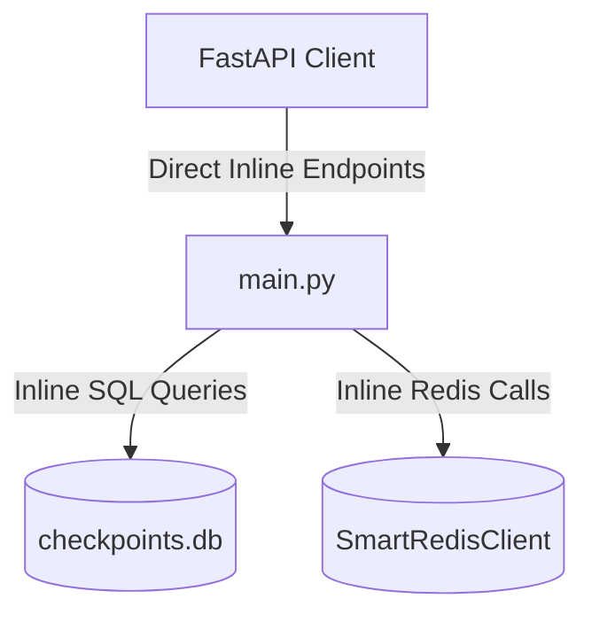

# Profile Domain Refactoring Report

This report documents the architectural separation of the Profile domain from the monolith `backend/app/main.py` into a clean-layered structure under `backend/app/`.

---

## 1. Architectural Changes

### Architecture Before
All profile and limits endpoints and schemas were coupled inside `main.py`:


### Architecture After
The profile and limits operations have been decomposed into distinct layers following standard Clean Architecture boundaries:
```mermaid
graph TD
    Client[FastAPI Client] -->|HTTP Request| API[api/profile.py]
    API -->|Validation & Request Models| Schemas[schemas/profile_schemas.py]
    API -->|Orchestration| Service[services/profile_service.py]
    Service -->|Plan Retrieval| Repository[repositories/profile_repository.py]
    Service -->|Usage & Profile Cache| Caching[core/security.py (Redis)]
    Repository -->|aiosqlite| DB[(checkpoints.db)]
```

---

## 2. Extraction Inventory

### Files Created
1.  [profile_schemas.py](file:///home/eb157/CrickAIt/backend/app/schemas/profile_schemas.py) — Houses the `UserProfileExtraction` validation model.
2.  [profile_repository.py](file:///home/eb157/CrickAIt/backend/app/repositories/profile_repository.py) — SQLite data-access for the user's plan.
3.  [profile_service.py](file:///home/eb157/CrickAIt/backend/app/services/profile_service.py) — Contains business logic for calculating plan limits and managing Redis user profile serialization.
4.  [profile.py](file:///home/eb157/CrickAIt/backend/app/api/profile.py) — FastAPI APIRouter exposing the 5 endpoints.

### Functions/Routes Moved
*   `UserProfileExtraction` model $\rightarrow$ [profile_schemas.py](file:///home/eb157/CrickAIt/backend/app/schemas/profile_schemas.py)
*   `get_limits` endpoint $\rightarrow$ [api/profile.py](file:///home/eb157/CrickAIt/backend/app/api/profile.py) & [services/profile_service.py](file:///home/eb157/CrickAIt/backend/app/services/profile_service.py)
*   `get_profile` & `save_profile` endpoints $\rightarrow$ [api/profile.py](file:///home/eb157/CrickAIt/backend/app/api/profile.py) & [services/profile_service.py](file:///home/eb157/CrickAIt/backend/app/services/profile_service.py)
*   `clear_profile` & `remove_profile_item` endpoints $\rightarrow$ [api/profile.py](file:///home/eb157/CrickAIt/backend/app/api/profile.py) & [services/profile_service.py](file:///home/eb157/CrickAIt/backend/app/services/profile_service.py)

---

## 3. Dependency & Integration
*   The `profile_router` is imported and mounted inside `main.py` using `app.include_router(profile_router)`.
*   `UserProfileExtraction` is imported from the new schemas file into `main.py` to maintain compatibility with the LangGraph/AI agent nodes.

---

## 4. Risks & Verification Summary
*   **Risks Encountered:** Ensuring that the AI agent extraction nodes could still safely import the Pydantic `UserProfileExtraction` model from the main namespace. This was solved by re-importing the model from the schemas package back into `main.py`.
*   **Verification:** Verified via 36 pytest regression tests, passing successfully with **78.77%** statement coverage.
