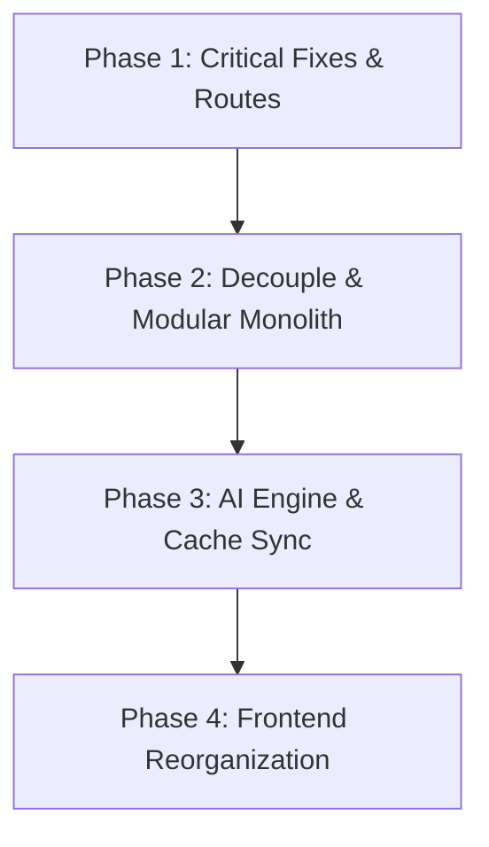

# CrickAIt Repository Refactoring Blueprint

This blueprint describes the architectural plan to transition CrickAIt from its current monolithic, prototype structure into a clean, modular, and horizontally scalable SaaS application.

---

## Part 1: Ideal Folder Structure Design

```text
CrickAIt/
├── backend/
│   ├── app/
│   │   ├── api/                   # API Routers & Controllers
│   │   │   ├── __init__.py
│   │   │   ├── admin.py
│   │   │   ├── auth.py
│   │   │   ├── chat.py
│   │   │   ├── live.py
│   │   │   └── notifications.py
│   │   ├── core/                  # Core Configurations & Security
│   │   │   ├── __init__.py
│   │   │   ├── config.py          # Unified Pydantic Settings
│   │   │   ├── exceptions.py      # Custom Exceptions & Central Handler
│   │   │   ├── logging_config.py  # Structured Logger setup
│   │   │   └── security.py        # Password, JWT, and Turnstile security
│   │   ├── services/              # Business Logic
│   │   │   ├── __init__.py
│   │   │   ├── auth_service.py
│   │   │   ├── chat_service.py
│   │   │   └── score_service.py
│   │   ├── repositories/          # DB Persistence Layer (ORM Abstractions)
│   │   │   ├── __init__.py
│   │   │   ├── user_repository.py
│   │   │   └── checkpoint_repository.py
│   │   ├── agents/                # AI Agents & LangGraph orchestrations
│   │   │   ├── __init__.py
│   │   │   ├── graph.py           # LangGraph build & compilation
│   │   │   ├── nodes.py           # Router, Extractor, Expert, Summarizer nodes
│   │   │   └── prompts/           # Prompts isolation
│   │   │       ├── system_prompt.txt
│   │   │       └── extractor_prompt.txt
│   │   ├── providers/             # External API Adapters (Wrappers)
│   │   │   ├── __init__.py
│   │   │   ├── cricapi_provider.py
│   │   │   ├── cricbuzz_scraper.py
│   │   │   └── tavily_provider.py
│   │   ├── models/                # DB Entity schemas (PostgreSQL Ready)
│   │   │   ├── __init__.py
│   │   │   └── db_models.py       # SQLModel/SQLAlchemy schemas
│   │   ├── schemas/               # API Request/Response validations
│   │   │   ├── __init__.py
│   │   │   ├── auth_schemas.py
│   │   │   └── chat_schemas.py
│   │   └── main.py                # FastAPI Application Entry point
│   ├── tests/                     # Backend Test Suite
│   │   ├── conftest.py
│   │   ├── test_auth.py
│   │   ├── test_chat_agent.py
│   │   └── test_live_scores.py
│   └── requirements.txt
│
├── frontend/
│   ├── public/
│   │   ├── avatars/
│   │   └── favicon.png
│   ├── src/
│   │   ├── components/            # Isolated Presentational Components
│   │   │   ├── common/            # Custom alerts, overlays, modals
│   │   │   │   ├── CustomAlert.jsx
│   │   │   │   ├── ErrorOverlay.jsx
│   │   │   │   └── HelpModal.jsx
│   │   │   ├── auth/
│   │   │   │   ├── AuthOverlay.jsx
│   │   │   │   └── TermsOfServiceModal.jsx
│   │   │   ├── chat/
│   │   │   │   ├── ChatInterface.jsx
│   │   │   │   └── Sidebar.jsx
│   │   │   ├── matches/
│   │   │   │   ├── LiveMatches.jsx
│   │   │   │   └── ScorecardOverlay.jsx
│   │   │   └── admin/
│   │   │       └── AdminModal.jsx
│   │   ├── hooks/                 # Business Logic & Custom Fetch hooks
│   │   │   ├── useAuth.js
│   │   │   ├── useChat.js
│   │   │   └── useLiveScores.js
│   │   ├── contexts/              # Global state definitions
│   │   │   ├── AuthContext.jsx
│   │   │   └── UIContext.jsx
│   │   ├── services/              # API HTTP clients
│   │   │   └── api.js
│   │   ├── styles/                # CSS Modularization
│   │   │   ├── index.css
│   │   │   ├── auth.css
│   │   │   ├── chat.css
│   │   │   └── layout.css
│   │   ├── App.jsx                # Layout Shell & React Router config
│   │   └── main.jsx
│   ├── index.html
│   ├── package.json
│   └── vite.config.js
│
├── data/                          # Data files & seeds (git-ignored in production)
├── specs/                         # Project specifications & audits
└── start.sh
```

---

## Part 2: Detailed File Migration Specifications

Below is the blueprint mapping of the current files to their future positions.

### 1. Root & Script Files Migration

#### File: `main.py`
*   **Current Location:** `main.py`
*   **Future Location:** Deconstructed into `backend/app/main.py`, `backend/app/api/*`, `backend/app/services/*`, `backend/app/repositories/*`, `backend/app/agents/*`, `backend/app/core/*`
*   **Reason:** The file is currently a 2,490-line monolith combining API routes, DB access, LangGraph states, scraping, and recovery logic. Splitting it establishes separation of concerns.
*   **Dependencies:** `requirements.txt`, `redis`, `sqlite`/`postgres`, `groq`
*   **Migration Order:** Phase 1 (Step 2)
*   **Risk:** High. Deconstructing the core coordinator requires careful refactoring of dependencies, routes, and imports. 
*   **Estimated Time:** 12 - 16 hours.

#### File: `data_loader.py`
*   **Current Location:** `data_loader.py`
*   **Future Location:** `backend/app/providers/data_loader.py` (or deleted if retired)
*   **Reason:** It is a loose script in the root directory. Moving it inside the `providers/` context standardizes ingestion tasks.
*   **Dependencies:** CricSheet JSON logs.
*   **Migration Order:** Phase 3 (Step 1)
*   **Risk:** Low. Not used by the runtime application.
*   **Estimated Time:** 0.5 hours.

#### File: `vector_store_builder.py`
*   **Current Location:** `vector_store_builder.py`
*   **Future Location:** `backend/app/providers/vector_store_builder.py`
*   **Reason:** Loose script in the root directory. Needs proper containment inside RAG/providers directory.
*   **Dependencies:** `sentence_transformers`, `faiss`
*   **Migration Order:** Phase 3 (Step 2)
*   **Risk:** Low.
*   **Estimated Time:** 1 hour.

#### File: `retriever.py`
*   **Current Location:** `retriever.py`
*   **Future Location:** `backend/app/services/retriever_service.py`
*   **Reason:** Isolated utility script in the root. Needs conversion into a clean retrieval service used by the expert agent.
*   **Dependencies:** `faiss`, `sentence_transformers`, `pickle`
*   **Migration Order:** Phase 3 (Step 3)
*   **Risk:** Medium. Requires integration as a LangGraph tool within the active agent.
*   **Estimated Time:** 3 hours.

#### File: `document_embeddings.py`
*   **Current Location:** `document_embeddings.py`
*   **Future Location:** Delete / Retain under `backend/app/providers/scratch/`
*   **Reason:** Duplicate scratchpad script with overlapping functionality from `vector_store_builder.py`.
*   **Dependencies:** `sentence_transformers`
*   **Migration Order:** Phase 3 (Step 4)
*   **Risk:** Low.
*   **Estimated Time:** 0.5 hours.

#### File: `vector_database.py`
*   **Current Location:** `vector_database.py`
*   **Future Location:** Delete / Retain under `backend/app/providers/scratch/`
*   **Reason:** Disjointed test script showing simple FAISS index operations.
*   **Dependencies:** `faiss`
*   **Migration Order:** Phase 3 (Step 5)
*   **Risk:** Low.
*   **Estimated Time:** 0.5 hours.

#### File: `demo for langgraph.py`
*   **Current Location:** `demo for langgraph.py`
*   **Future Location:** Delete
*   **Reason:** Temporary scratch file showing basic LangGraph execution examples, no longer needed in the workspace.
*   **Dependencies:** `langgraph`
*   **Migration Order:** Phase 1 (Step 1)
*   **Risk:** Low.
*   **Estimated Time:** 0.2 hours.

#### File: `frontend.py`
*   **Current Location:** `frontend.py`
*   **Future Location:** `backend/app/frontend_streamlit.py` (or deleted if fully moving to React)
*   **Reason:** Streamlit-specific alternative frontend currently cluttering the root.
*   **Dependencies:** `streamlit`, backend HTTP APIs
*   **Migration Order:** Phase 3 (Step 6)
*   **Risk:** Low.
*   **Estimated Time:** 1 hour.

#### File: `start.sh`
*   **Current Location:** `start.sh`
*   **Future Location:** `start.sh` (retrained at root, but paths updated)
*   **Reason:** Coordinates process startup. Paths to uvicorn and streamlit run must be updated to reference `backend/app/main.py`.
*   **Dependencies:** `docker`, `uvicorn`, `streamlit`
*   **Migration Order:** Phase 1 (Step 3)
*   **Risk:** Medium. Changing workspace execution targets can impact deployment pipelines.
*   **Estimated Time:** 1 hour.

---

### 2. Frontend Files Migration

#### File: `frontend/src/App.jsx`
*   **Current Location:** `frontend/src/App.jsx`
*   **Future Location:** `frontend/src/App.jsx` (Redesigned with Router components and context providers)
*   **Reason:** Currently mixes modal state changes, alerts triggers, conditional page navigation logic, and theme CSS manipulation. Need to inject context wraps.
*   **Dependencies:** `react-router-dom`, `AuthContext`, `UIContext`
*   **Migration Order:** Phase 4 (Step 1)
*   **Risk:** High. Redesigning navigation parameters requires updating state properties across all layouts.
*   **Estimated Time:** 4 - 6 hours.

#### File: `frontend/src/components/AuthOverlay.jsx`
*   **Current Location:** `frontend/src/components/AuthOverlay.jsx`
*   **Future Location:** `frontend/src/components/auth/AuthOverlay.jsx`
*   **Reason:** Massive 70KB component file mixing multiple auth pages. Should be split into smaller sub-components (Login, Register, RecoverPassword).
*   **Dependencies:** `api.js`, UI styling layouts
*   **Migration Order:** Phase 4 (Step 2)
*   **Risk:** High. Splitting layout variables can break CSS scopes and form handlers.
*   **Estimated Time:** 6 - 8 hours.

#### File: `frontend/src/components/SettingsModal.jsx`
*   **Current Location:** `frontend/src/components/SettingsModal.jsx`
*   **Future Location:** `frontend/src/components/common/SettingsModal.jsx`
*   **Reason:** Massive 57KB modal with dense preference modifications. Needs split into tab pages (PreferencesTab, ProfileTab, SecurityTab, BillingTab).
*   **Dependencies:** `api.js`, State parameters
*   **Migration Order:** Phase 4 (Step 3)
*   **Risk:** Medium.
*   **Estimated Time:** 4 - 6 hours.

#### File: `frontend/src/components/AppLayout.jsx`
*   **Current Location:** `frontend/src/components/AppLayout.jsx`
*   **Future Location:** `frontend/src/components/common/AppLayout.jsx`
*   **Reason:** Massive layout component that handles dropdown visibility, notification updates, live matches drawer state, and active navigation views.
*   **Dependencies:** `Zustand` / `UIContext`
*   **Migration Order:** Phase 4 (Step 4)
*   **Risk:** High.
*   **Estimated Time:** 5 - 7 hours.

#### File: `frontend/src/components/ChatInterface.jsx`
*   **Current Location:** `frontend/src/components/ChatInterface.jsx`
*   **Future Location:** `frontend/src/components/chat/ChatInterface.jsx`
*   **Reason:** Isolates chat view. Requires update to handle dynamic Server-Sent Event (SSE) token chunks instead of complete string JSON returns.
*   **Dependencies:** `useChat.js` hook
*   **Migration Order:** Phase 4 (Step 5)
*   **Risk:** Medium. Replacing fetch handlers with stream reading requires robust client-side chunk parsers.
*   **Estimated Time:** 3 - 5 hours.

#### File: `frontend/src/components/LiveMatches.jsx`
*   **Current Location:** `frontend/src/components/LiveMatches.jsx`
*   **Future Location:** `frontend/src/components/matches/LiveMatches.jsx`
*   **Reason:** Exposes live match scores list. Needs update to fetch from `/api/v1/live-scores` (properly namespaces routes).
*   **Dependencies:** `/live-scores` API endpoint
*   **Migration Order:** Phase 1 (Step 4)
*   **Risk:** Low. Requires update to fetch URL parameter.
*   **Estimated Time:** 1 hour.

#### File: `frontend/src/style.css`
*   **Current Location:** `frontend/src/style.css`
*   **Future Location:** Split into `frontend/src/styles/index.css`, `frontend/src/styles/chat.css`, `frontend/src/styles/auth.css`
*   **Reason:** 61KB style file is difficult to navigate. Splitting allows smaller css deliveries based on page rendering.
*   **Dependencies:** HTML layouts
*   **Migration Order:** Phase 4 (Step 6)
*   **Risk:** Medium. Risk of losing CSS declarations and breaking responsive overlays.
*   **Estimated Time:** 4 - 6 hours.

#### File: `frontend/src/services/api.js`
*   **Current Location:** `frontend/src/services/api.js`
*   **Future Location:** `frontend/src/services/api.js`
*   **Reason:** Holds HTTP utility fetching and local token parsing. Needs update to target `/api/v1` namespace and format authentication headers cleanly.
*   **Dependencies:** LocalStorage access
*   **Migration Order:** Phase 1 (Step 5)
*   **Risk:** Medium. Crucial entry point for all API requests.
*   **Estimated Time:** 1.5 hours.

#### File: All Other Frontend Components (`AdminModal.jsx`, `BugReportModal.jsx`, etc.)
*   **Current Location:** `frontend/src/components/*.jsx`
*   **Future Location:** Grouped logically inside `frontend/src/components/common/`, `frontend/src/components/auth/`, `frontend/src/components/chat/`
*   **Reason:** Standardizes folder layout and isolates common modules.
*   **Dependencies:** Common imports
*   **Migration Order:** Phase 4 (Step 7)
*   **Risk:** Low. Simple path updates.
*   **Estimated Time:** 2 - 3 hours total.

---

## Part 3: Migration Phases & Dependencies Graph



### Phase 1: Critical Fixes & Routes (Time: ~20 hours)
*   *Step 1:* Clear deprecated root files (`demo for langgraph.py`, logs).
*   *Step 2:* Add the missing route decorator on `get_scores()` and verify the `/live-scores` REST calls.
*   *Step 3:* Move API endpoints to `/api/v1/` prefixes.
*   *Step 4:* Upgrade user session tokens to signed, verified JWT objects.

### Phase 2: Decoupling & Modular Monolith (Time: ~35 hours)
*   *Step 1:* Introduce SQLAlchemy/SQLModel database configurations.
*   *Step 2:* Setup Alembic migrations scripts for local/cloud setups.
*   *Step 3:* Extract SQL queries out of routes and write clean Repository classes.
*   *Step 4:* Disintegrate `main.py` into separate app controllers, service modules, and configuration packages.
*   *Step 5:* Swap SQLite checkpointing for PostgresSaver checkpointing.

### Phase 3: AI Engine & Cache Sync (Time: ~15 hours)
*   *Step 1:* Replace process-local news and matches cache states with Redis caching keys.
*   *Step 2:* Expose dynamic dates instead of hardcoded date prompts in systemic agent queries.
*   *Step 3:* Clean up disjoint RAG scripts and embed the retriever index directly into the LangGraph expert model context.

### Phase 4: Frontend Reorganization (Time: ~30 hours)
*   *Step 1:* Integrate React Router and dynamic routing controllers.
*   *Step 2:* Establish Zustand state stores to eliminate prop drilling.
*   *Step 3:* Break up God CSS and component files (`AuthOverlay.jsx`, `SettingsModal.jsx`) into separate feature modules.
